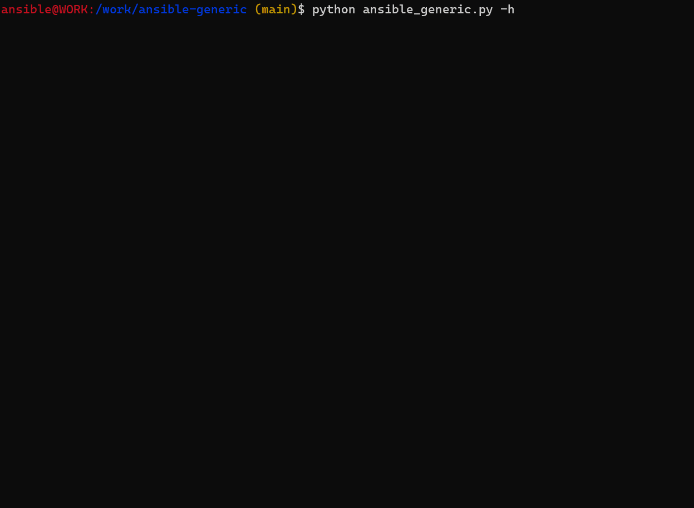

# ansible-generic

## Description

Permet de générer une tâche générique avec boucle à partir des informations founis par la documentation ansible.

## Prérequis

- python 3
- ansible-core

## Utilisation 

### Aide

```bash
python ansible_generic.py -h

usage: ansible_generic.py [-h] module

Template Generic Ansible Loop Task.

positional arguments:
  module      Ansible Module

options:
  -h, --help  show this help message and exit
```

### Module

```bash
python ansible_generic.py <module>
```

## Exemple


